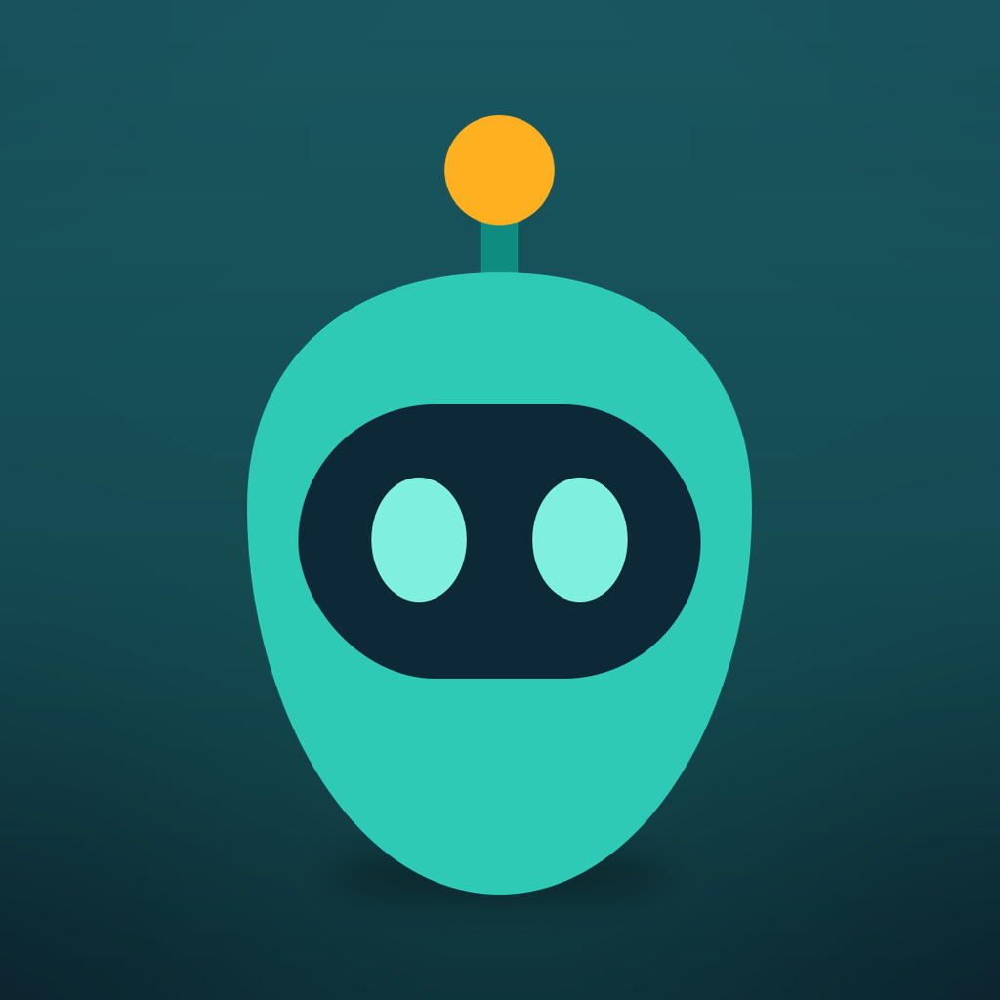

<p align="center">
  
</p>

<h1 align="center">HeyDebby 👆</h1>

<p align="center">An AI buddy that lives in your Mac's notch — hold ⌃⌥ and talk about what's on your screen; she answers out loud and points at things. Native Swift, zero dependencies.</p>

## Features

| Feature | How it works |
|---|---|
| Hotkey activation | **⌃⌥ hold-to-talk** — hold to dictate, release to send; quick-tap latches on and silence sends |
| Sees your screen | Fresh screenshot per question via ScreenCaptureKit |
| Talk mode (voice) | Live speech-to-text, auto-sends after 1.6s of silence |
| Speaks answers | **ElevenLabs** voices by default (falls back to native macOS TTS when no key is set) — ⚙︎ → Voice engine |
| Live web data | Pulls current prices/news/pages on demand via **context.dev** — see below |
| Screen drawing | Pulsing orange pointers + labels drawn on a click-through overlay, auto-hide in 8s |
| Background agents | "agent: clean my downloads" → runs Codex CLI (`codex exec`) or [Claude Code](https://claude.com/claude-code) (`claude -p`) in the background. Each gets a pill on the right edge of the screen; hover to watch it work. Run as many as you like and keep talking to Debby meanwhile. With *full access* (below) an agent has a shell, so the job is anything a command can do |
| Sits next to cursor | A 👆 companion pointer trails your cursor and glides to each marked spot to draw the highlight — **while you talk it turns into a 5-bar audio visualiser**, same spot, same size |
| Step-by-step walkthroughs | One pointer at a time; when you click, Debby sees the new screen and points at the next step automatically ("I did it" button in the notch as fallback). ✕ ends the session |
| Containers (focus areas) | Viewfinder button → drag a box on screen; questions are scoped to just that area (screenshot is cropped to it, pointers map back correctly) |
| Privacy: screenshots never stored | One overwritten temp file, captured only when you ask |

## The notch

Every control lives in the notch, not in a window. It sits flush over the camera
housing (a slim pill on displays without one) and is **click-through until your
cursor touches it** — the menu bar underneath keeps working. It opens on hover,
and by itself whenever there's something to show: listening, thinking, an answer.

Agents are the one thing it doesn't show — they have the rail (below). A ten-minute
background job used to hold the notch open the whole time, which put the mic inside a
panel busy reporting something else.

Open, left to right: mic (click = talk), live transcript or Debby's last answer,
mic bars — then **I did it** (next walkthrough step), **⌖** focus area,
**✎** start over, **⚙︎** settings, **✕** end session.

## Brains

Five interchangeable backends (⚙︎ → Brain). **Auto** prefers whichever subscription
is already signed in — Codex, then Claude — and only falls back to a paid API key:

- **Codex (ChatGPT subscription)** — OpenHands-style: reuses the Codex CLI's OAuth
  token from `~/.codex/auth.json` and calls the ChatGPT Codex responses endpoint
  directly. No API key, billed to your ChatGPT plan. Model follows your
  `~/.codex/config.toml` (override in settings). The token never leaves your
  machine except to OpenAI's own API. Needs `codex login` once. If the session
  expires, run any codex command to refresh.
- **Claude (Claude plan)** — same trick for your Claude subscription: shells out to
  the `claude` CLI, so no API key. The screenshot is passed as a file path and the CLI
  reads it (`--system-prompt` to replace the coding-agent persona, `--allowedTools Read`
  scoped to reading that one image). Needs `claude` signed in.
- **Claude API key** — Anthropic API key (settings or `ANTHROPIC_API_KEY`), default
  model `claude-sonnet-5`.
- **Gemini (Google AI)** — Google's Gemini with vision (settings, or `GOOGLE_API_KEY` /
  `GEMINI_API_KEY`), default `gemini-3.1-flash-lite`. Get a key at aistudio.google.com.
- **OpenAI (GPT-5.6)** — OpenAI Responses API (settings or `OPENAI_API_KEY`), default
  `gpt-5.6-luna` (`-terra` / `-sol` are stronger and slower). The only **streaming**
  brain: Debby starts talking in about a second and draws each shape as she describes
  it — this is what powers realtime lessons.

Agents follow the same choice: Codex agents run `codex exec` (read-only sandbox
by default; the *full access* toggle uses `--dangerously-bypass-approvals-and-sandbox`),
Claude agents run `claude -p` (toggle adds `--dangerously-skip-permissions`).

## Beyond the basics

The features that make Debby more than a screen reader. Architecture and rationale
for all of it are in [TECH-SPEC.md](./TECH-SPEC.md).

- **Live web data (context.dev).** Debby answers about your screen, but the screen
  points at the live web — prices, docs, availability — that changes by the minute.
  When the honest answer needs something current, she emits a `FETCH:` for a URL or a
  search; Swift pulls it from [context.dev](https://context.dev) (scrape-to-Markdown
  or web search), folds the fresh result back into the turn, and answers from it —
  citing the source. So *"is this cheaper anywhere else?"* is answered from the web as
  it is right now, not from training data. On behind a context.dev key (⚙︎ → Live web
  data, or `CONTEXT_API_KEY`).
- **Natural voice (ElevenLabs) — the default.** Debby speaks with **ElevenLabs** out of
  the box (⚙︎ → Voice engine is set to **ElevenLabs** by default, voice *Sarah*, any Voice
  ID works). Add the key in settings or `ELEVENLABS_API_KEY`; until then — and on any
  failure — she falls straight back to the native macOS voice, so she never goes silent.
  Switch ⚙︎ → Voice engine to **System (macOS)** to stay on the native voice.
- **Realtime lessons — draw while talking.** With the OpenAI brain, replies stream:
  Debby starts speaking in ~1s and each shape appears *as* she narrates it (a queue
  keeps the drawing in step with the voice), instead of drawing everything up front.
- **App control (`RUN:`).** *"Turn the volume up"* / *"play Blackstar on Spotify"*
  happens in ~2s without spinning up an agent — the chat brain emits one AppleScript
  statement, run as `osascript` arguments (never a shell string). Behind **⚙︎ → Let
  Debby control apps** (off by default); macOS prompts for Automation per app.
- **Form filling & browser control.** *"agent: renew my passport at gov.uk"* opens a
  visible browser (Playwright MCP), fills the form from your own documents, and
  **stops before anything irreversible to ask you** — a `NEED:` confirm gate you can
  ✓/✕ in the notch. Debby never types a password, card number, or one-time code, and
  never attempts a CAPTCHA. Your details come from a `0600` `profile.json` you scan
  once (**⚙︎ → Connected apps / Documents**); the gate has no off switch and *full
  access* can't bypass it. Behind **⚙︎ → Enable browser control** (needs the `claude`
  CLI).

## Build & run

Prerequisites: **macOS 14+** and the **Swift toolchain** (Xcode or the Command Line
Tools — `xcode-select --install`). Node.js (`npx`) is only needed for the MCP
features (Composio app integrations, browser control). No API key is required if
you're signed into the Codex or `claude` CLI.

```bash
./build.sh              # debug build → --selfcheck → release build → codesign
open build/HeyDebby.app
```

Hold **⌃⌥** and talk. Hover the notch for the controls; **👆** in the menu bar
also starts/stops listening, as does re-opening the app.

First-run setup (configure):
1. **Brain** (⚙︎): if you're logged into the Codex CLI it just works. Otherwise `codex login`, sign into the `claude` CLI, or paste a key in **⚙︎** — Anthropic (`ANTHROPIC_API_KEY`), Google (`GOOGLE_API_KEY`), or OpenAI (`OPENAI_API_KEY`).
2. macOS will prompt for **Microphone** and **Speech Recognition** — allow both.
3. **Accessibility** — a modifier-only chord like ⌃⌥ can't be a Carbon hot key, so it's read from the global event stream. Grant it in System Settings → Privacy & Security → Accessibility, then relaunch.
4. First screen question: grant **Screen Recording** too, then relaunch (macOS requires it).
5. Optional in **⚙︎**: paste a **context.dev** key for live web data, switch **Voice engine** to ElevenLabs, enable *Let Debby control apps* (Automation) or *browser control* (needs the `claude` CLI + `npx`), and scan your documents for form-filling.

## Usage

- **Talk:** hold **⌃⌥** and speak ("what does this error mean?"), release to send.
  Or quick-tap ⌃⌥ to latch listening on — it then sends after you pause. Debby
  answers aloud and draws pointers on screen when useful. While you talk, the
  companion pointer becomes a live audio visualiser so you can see it hearing you.
- **Agents:** start with "agent", "agent:", or "hey debby agent" — e.g.
  *"agent: summarize the PDFs on my Desktop"*. Runs from your home directory.

## The agent rail

Every agent gets a pill down the right edge of the screen saying what you asked for.
**Hover one** and it opens into a card: the last few lines of output as they stream, how
long it's been going, and a **Stop** button. Move away and it shrinks back. The strip is
click-through everywhere except the pills themselves, so the window underneath keeps
working.

Agents are independent of the conversation. Start as many as you like, keep talking to
Debby while they run, ask her something else — none of it disturbs them. Neither ✕ nor
**Start over** stops an agent; only its own **Stop** does. (Both used to kill every running
agent, back when the notch was the only place one could report.)

Colours: white running, **orange** waiting on you, green done, red failed. A finished card
clears itself after a few seconds; a failed one stays until you dismiss it, because the
exit code and the last lines are the whole diagnosis.

When an agent hits something irreversible — submitting a form, sending a payment — it stops
and asks. The question appears on that agent's own card with **Confirm** and **Cancel**, and
Debby reads it aloud. Confirm resumes the exact session that asked, so two agents waiting at
once can't get their answers crossed.

## What agents can actually do

Read-only by default, and that is a real limit, not a soft one: an agent can read your
files and use your connected apps, but it cannot create or change anything on this Mac.
Ask a read-only agent for a spreadsheet and it will do the thinking, then tell you in one
line that the rest needs **⚙︎ → Agents: full access**. It won't report success over a job
that never happened.

With **full access** on it can finish the job — and anything else, without prompts. That
one toggle is both the on switch and the whole safety story; there is no middle setting.
Off by default.

There's no list of supported tasks, because the capability isn't a set of integrations —
it's a shell. Usually that means Debby writes a small Python script and runs it, so the job
is whatever a script can do: an Excel workbook, a PowerPoint deck, a Word document, a PDF,
a chart, a converted folder of images, a database query, a thousand renamed files. Any
library it needs that isn't installed it fetches for that run only (`uv run --with …`,
`uvx …`), so nothing is left behind on your Mac afterwards. The script is kept next to what
it produced, so you can re-run or tweak it without asking again.

Finished work lands in **`~/Debby`** and is opened for you when it's done. Output is the
real format rather than a lookalike — a genuine `.xlsx` with working formulas, a real
`.pptx`, not something with the wrong extension — and files are built by writing them,
never by remote-controlling Excel or PowerPoint through AppleScript, which needs an
Automation grant, breaks with the app closed, and can clobber unsaved edits. Agents check
their own work before reporting it done. Try *"agent: turn the receipts in my Downloads
into a spreadsheet of what I spent"* or *"agent: make a deck from the notes on my
Desktop"*.

`~/Debby` is where output *goes*, not a sandbox: `--dangerously-skip-permissions` scopes
nothing, so a full-access agent can write anywhere. The folder buys predictability, not
containment.

One thing Debby pins on your behalf: `--allowedTools` *adds to* your own
`~/.claude/settings.json` rather than replacing it, so a `permissions.defaultMode` of
`auto` there would quietly hand every "read-only" agent write access. Debby passes
`--permission-mode manual` so its agents behave the same on every Mac, whatever your
claude CLI is configured to do.

## Requirements

- macOS 14+ (Sonoma), Swift toolchain
- One brain: a Codex CLI login (ChatGPT plan), a `claude` CLI login (Claude plan),
  **or** an Anthropic / Google / OpenAI API key
- Node.js (`npx`) — only for the MCP features: Composio app integrations and
  browser control (form filling)
- Optional: a **context.dev** key for live web data, an **ElevenLabs** key for its
  voices (both have free tiers; both fall back gracefully when unset)

## App integrations (Composio)

Agents can use your apps — Gmail, Calendar, Notion, Slack, GitHub, 500+ more —
through the [Composio](https://composio.dev) MCP gateway
(`https://connect.composio.dev/mcp`), registered with both the codex and claude
CLIs. Try *"agent: summarize my unread emails"*.

Manage them in **⚙︎ → Connected apps**: a row per app (Gmail, Google Calendar,
Slack, Notion, GitHub, Drive, Sheets, Docs, Linear, Jira, HubSpot, Discord) with
a *Connect* button, plus *Other app…* for anything else by slug. *Refresh* marks
which ones are already connected. Connect gives you an authorization link to
open in the browser. Composio
has no local CLI or API key here — it's a remote MCP server, so both buttons work by
asking a CLI that holds the login. Each press is a real agent run: a minute or two.

Those buttons always use the **`claude`** CLI, whatever brain you picked for chat.
`codex exec` auto-denies `COMPOSIO_MANAGE_CONNECTIONS` with *"user cancelled MCP tool
call"* under every approval mode short of `--dangerously-bypass-approvals-and-sandbox`,
which is far too big a hammer for connecting an app. `claude` takes
`--allowedTools mcp__composio` — Composio's tools and nothing else. It needs a one-time
`/mcp` auth in an interactive `claude` session.

## When something doesn't work

**⚙︎ → Open log…** — `~/Library/Logs/HeyDebby/debby.log`. Ordinary CLI invocations record
the full command, streamed output, and exit code. Document/profile scans are private: only
their generic start and exit status are logged, never the scan prompt or extracted values.
The log is trimmed to the last 500 KB once it passes 2 MB and is readable only by your user.

The failure worth knowing about: `user cancelled MCP tool call` means `codex exec`
auto-denied a Composio *write* (send an email, create a connection). Codex can't
approve MCP tools non-interactively under any approval mode, which is why agents and
the Connect buttons use `claude` with a scoped `--allowedTools` instead.

## Deliberately skipped

Typing (it's voice-only now), chat history, wake-word ("hey debby"
always-listening), streaming for the non-OpenAI brains (only OpenAI streams today),
a configurable hotkey, a notch per display, Windows. Add when the need is real.

`./build.sh` runs `--selfcheck` (assertions are compiled out of release builds, so
it runs the debug binary). `--notchcheck [out.png]` prints the notch geometry this

Mac measured and renders the HUD offscreen to eyeball it. Headless link checks, each
reading keys the way the app does: `--chat-check` (the full live-web-data turn:
model → `FETCH:` → context.dev → answer), `--context-check` (`DEBBY_FETCH=<url|query>`),
`--eleven-check`, `--codex-check`, `--gemini-check`.

Mac measured and renders the HUD offscreen to eyeball it — plus `out.png.rail.png`,
the agent rail with every card state at once.

`--agent "task" ["task" …]` starts the app with those agents already running, which is
how you exercise the rail (several at once, hover, Confirm) without talking to it:

```bash
open build/HeyDebby.app --args --agent "count the files in my Downloads" "summarise my Desktop"
```

